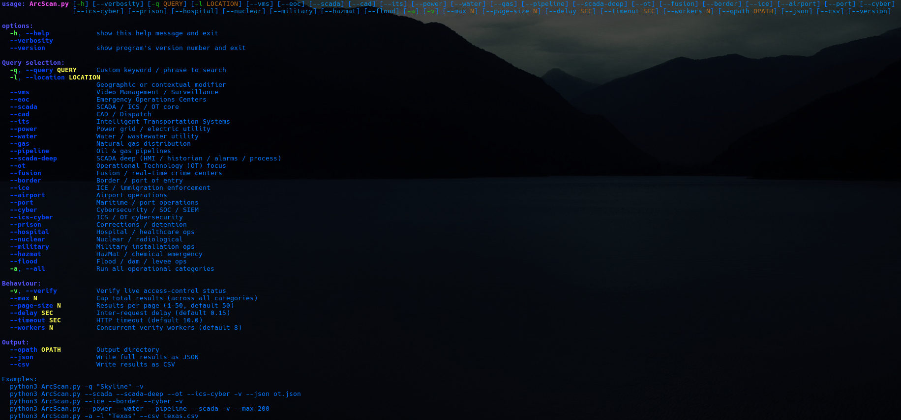

<div align="center">

# ArcScan

**Version** `0.1.2` · **Author** [J4ck3LSyN](https://jackalsyn.com) · **Source** [GitHub](https://github.com/J4ck3LSyN-Gen2/ArcScan)

[](https://github.com/J4ck3LSyN-Gen2/ArcScan)
[](https://www.python.org/)
[](https://pypi.org/project/requests/)

</div>

---

**ArcScan** is a lightweight reconnaissance utility that queries the public ArcGIS REST search API for operational dashboards and reports their visibility status. It is designed for open-source intelligence (OSINT), situational awareness research, and authorized testing.

> **Disclaimer**  
> This tool only interacts with publicly available ArcGIS endpoints.  
> Use it only against targets you own or have explicit permission to assess.  
> Unauthorized access to systems is illegal. The author assumes no responsibility for misuse.

## Features

* Query the public ArcGIS search API for dashboards
* Optional live visibility check (`EXPOSED` / `LOCKED` / `RESTRICTED`)
* Multithreaded verification
* Custom keyword + location filtering
* JSON and CSV export
* Rate-limit friendly delays and randomized User-Agents

## Requirements

* Python 3.8+
* `requests`

## Installation

```bash
git clone https://github.com/J4ck3LSyN-Gen2/ArcScan.git
cd ArcScan
python3 -m venv venv
source venv/bin/activate  # (.fish if your swimming)
python3 -m pip install --upgrade pip
python3 -m pip install requests

```

## Usage

<p align="center">
  
</p>

### Query Selection Flags

* `-q, --query <str>`: Custom keyword or phrase to search.
* `-l, --location <str>`: Geographic or contextual modifier.
* `--vms`: Video Management / Surveillance dashboards.
* `--its`: Intelligent Transportation Systems.
* `--ot`: Operational Technology (OT) focus.
* `--fusion`: Fusion / real-time crime centers.
* `--border`: Border / port of entry.
* `--ice`: ICE / immigration enforcement.
* `--airport`: Airport operations.
* `--port`: Maritime / port operations.
* `--cyber`: Cybersecurity / SOC / SIEM.
* `--flood`: Flood / dam / levee ops.
* `-a, --all`: Execute all operational category queries.

### Behaviour and Tuning Flags

* `-v, --verify`: Verify live access control status for discovered items.
* `--max <N>`: Cap total results collected across categories.
* `--page-size <N>`: Configure results per page (1 to 100, default 50).
* `--delay <SEC>`: Set inter-request delay in seconds (default 0.15).
* `--timeout <SEC>`: Set HTTP timeout in seconds (default 10.0).
* `--workers <N>`: Set concurrent verification worker count (default 8).

### Output Flags

* `--opath <path>`: Output directory for reports (default: `.output`).
* `--json`: Write full results as a JSON export.
* `--csv`: Write results as a CSV export.

## Examples

Search for custom keywords with verification enabled:

```bash
python3 ArcScan.py -q "Skyline" -v

```

Audit specific OT and cybersecurity vectors with JSON output:

```bash
python3 ArcScan.py --ot --cyber -v --json ot.json

```

Target infrastructure with a regional modifier and result cap:

```bash
python3 ArcScan.py --its --vms -l "Texas" -v --max 200

```

Execute a full-spectrum operational scan using 16 workers and export to CSV:

```bash
python3 ArcScan.py -a --workers 16 -v --csv scan_results.csv

```

## Disclaimer

This tool is developed strictly for authorized security auditing, threat intelligence research, and isolated testing lab scenarios. Unauthorized access probing against live targets is prohibited.
